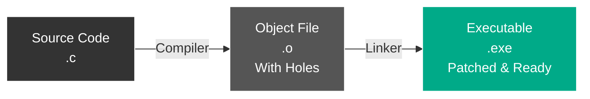
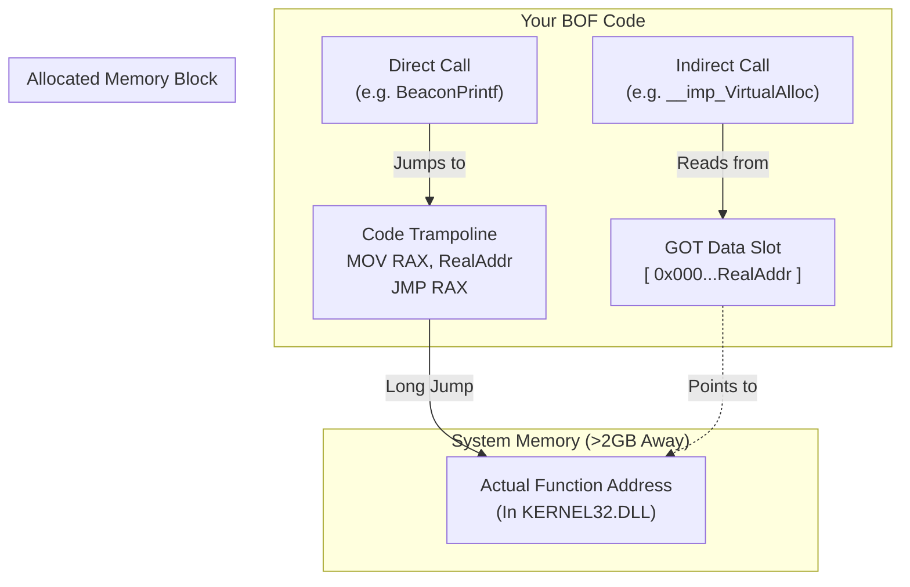

## Introduction

A **COFF (Common Object File Format) Loader** is a critical component in modern Command & Control (C2) frameworks. It allows operators to execute small, compiled C programs (Beacon Object Files or BOFs) directly in the memory of the agent without dropping files to disk or starting new processes. This technique, popularized by Cobalt Strike, offers immense stealth and modularity.

In this post, we'll explore how to build a custom COFF loader from scratch.

## The Concept of a Linker (And Why It Matters)

To understand a COFF loader, you must first understand the role of a **Linker**.

When you write code in C or C++, you compile it into an **Object File** (`.o` or `.obj`). This file contains machine code, but it's incomplete. It has "holes" in it because the compiler doesn't know:
1.  Where standard functions like `printf` or `VirtualAlloc` live in memory.
2.  Where your own global variables will effectively be located.

In a normal build process, the **Linker** takes these object files, fills in the holes (Resolving Symbols), connects pieces together, and produces a final Executable (`.exe`).



### The COFF Loader is a "Runtime Linker"
A C2 Agent doesn't have the luxury of running `gcc` or `ld` on the victim machine. Instead, the **COFF Loader** acts as a lightweight, in-memory linker.
*   It takes the raw `.o` file (the BOF).
*   It allocates memory for it.
*   It finds the missing functions (e.g., finding where `kernel32.dll` is loaded).
*   It "patches" the code on the fly so it can run correctly.
## Understanding the COFF Format
Before writing a loader, you must understand what you are loading. A `.o` file (object file) produced by a compiler (like Mingw-w64 or MSVC) contains:

1.  **File Header**: Metadata about the target machine (x64/x86), timestamp, and number of sections.
2.  **Section Headers**: Descriptors for code (`.text`), initialized data (`.data`), and read-only data (`.rdata`).
3.  **Raw Data**: The actual bytes for the sections.
4.  **Symbol Table**: List of functions and variables (internal and external).
5.  **Relocations**: Instructions on how to patch the code when it's loaded into memory (since the compiler didn't know the final memory address).

## The 5 Stages of Loading

### Step 1: Parsing & Validation
The first step is to read the `COFF_HEADER` and validate it.

```cpp
// Check for x64 Machine type (0x8664)
if (header->Machine != 0x8664) return Error("Unsupported architecture");
```

### Step 2: Memory Allocation
Unlike a standard OS loader, we must manually allocate memory. 

**Critical Security Note**: Do not allocate everything as `RWX` (Read-Write-Execute). This is a major red flag for AV/EDR.
*   Allocate as `RW` (Read-Write) initially.
*   After copying and patching, change permissions to `RX` (Read-Execute) for code and `RO` (Read-Only) for constant data.

```cpp
// Good practice: Memory Protection
DWORD oldProt;
VirtualProtect(codeSection, codeSize, PAGE_EXECUTE_READ, &oldProt);
VirtualProtect(dataSection, dataSize, PAGE_READWRITE, &oldProt);
```

### Step 3: Copying Sections
Iterate through the `SectionHeaders` and copy the data from the file layout to our allocated memory layout.

### Step 4: Processing Relocations
This is where we "link" the code manually. The compiler leaves placeholders (like `0x00000000`) where addresses should be. We must calculate the real address and update the placeholder.

Common x64 Relocation Types:
- **REL32 (0x0004)**: Relative 32-bit offset (Source + Offset). Used for `call` instructions.
- **ADDR64 (0x0001)**: Absolute 64-bit address. Used for pointers to global variables.

### Step 5: Resolving Symbols (Imports)
BOFs need to call Windows APIs. Since they aren't standard EXEs, they can't import `kernel32.dll` automatically. They rely on the loader to find the functions.

If a BOF asks for `__imp_KERNEL32$VirtualAlloc`, your loader must:
1.  Load `kernel32.dll`.
2.  Find `VirtualAlloc`.
3.  Write that function's address into the BOF's memory.

## Example: Writing and Running a "Whoami" BOF

Let's create a simple BOF that prints the current username.

### 1. The C Code (`whoami.c`)
For simplicity, we will include the necessary definitions directly in the file.
```c
#include <windows.h>

// --- BOF Declarations (Normally in bofdefs.h) ---

// 1. Beacon API Types
#define CALLBACK_OUTPUT      0x0
#define CALLBACK_ERROR       0x0d

// 2. Beacon API Functions
void BeaconPrintf(int type, char * fmt, ...);

// 3. Dynamic Function Declarations (LIBRARY$Function)
WINADVAPI BOOL WINAPI ADVAPI32$GetUserNameA(LPSTR lpBuffer, LPDWORD pcbBuffer);
WINBASEAPI DWORD WINAPI KERNEL32$GetLastError(VOID);

// ------------------------------------------------

// Entry point is always 'go'
void go(char* args, int len) {
    char username[256];
    DWORD size = 256;

    // We can't call GetUserNameA directly! We must use the dynamic function pointer.
    if (ADVAPI32$GetUserNameA(username, &size)) {
        BeaconPrintf(CALLBACK_OUTPUT, "[*] Current User: %s\n", username);
    } else {
        BeaconPrintf(CALLBACK_ERROR, "[-] Failed to get username. Error: %d\n", KERNEL32$GetLastError());
    }
}
```

### 2. Compiling
You need `mingw-w64` (on Linux) or a compatible compiler.
```bash
x86_64-w64-mingw32-gcc -c whoami.c -o whoami.o
```
*Note: The `-c` flag is crucial! It tells GCC to compile to an object file (`.o`) and stop before linking.*


### 3. Running with the Loader
Pass the `whoami.o` file to your loader.
1.  Loader reads `whoami.o`.
2.  Allocates memory.
3.  Resolves `ADVAPI32$GetUserNameA` to the real address in `advapi32.dll`.
4.  Finds the `go` symbol.
5.  Digital execution!

## Advanced Safety & Evasion

A basic loader works, but a **safe** loader keeps your operation alive and undetected. Here are the critical safety mechanisms you must implement:

### 1. Avoid RWX Memory (Memory Protection)
The most common mistake is allocating memory as `PAGE_EXECUTE_READWRITE` (RWX). This is a massive red flag for EDRs.
**The Safe Way:**
1.  Allocate memory as `PAGE_READWRITE` (RW).
2.  Copy your sections and perform relocations.
3.  **Flip protections** to `PAGE_EXECUTE_READ` (RX) for text sections and `PAGE_READONLY` (R) for data sections using `VirtualProtect`.
4.  Execute.

### 2. Clearing Hardware Breakpoints (Anti-EDR)
Many EDRs and anti-cheat systems hook threads by setting **Hardware Breakpoints** (using debug registers `Dr0`, `Dr1`, `Dr2`, `Dr3`) rather than modifying the code in memory (which is easier to detect).
**The Fix:**
Before executing the BOF, manually zero out these registers. This "blinds" any monitoring tools attached to your thread.
*(See `ClearHardwareBreakpoints` in the reference code below)*.

### 3. Crash Protection (SEH/VEH)
BOFs are unstable. If a BOF has a bug (e.g., null pointer dereference), it normally crashes the **entire process**. If your loader is running inside your C2 agent, **your agent dies**.
**The Fix:**
Wrap the execution in an Exception Handler.
-   **SEH (`__try`/`__except`)**: Microsoft-specific, easier to implement.
-   **VEH (Vectored Exception Handler)**: Global handler, more robust for some edge cases.

```cpp
// Simplified Safety Wrapper
__try {
    go(args, len);
}
__except (EXCEPTION_EXECUTE_HANDLER) {
    BeaconPrintf(CALLBACK_ERROR, "CRASH! The BOF attempted an illegal operation (Code: 0x%x)", GetExceptionCode());
}
```

### 4. Memory Hygiene
Never leave your payload in memory.
1.  **Zero it out**: Use `memset` or `RtlSecureZeroMemory` to overwrite the memory with zeros.
2.  **Free it**: Release the memory back to the OS.
Leaving strictly formatted COFF data in the heap is an easy way to get signatured during a memory scan.
## Deep Dive: Troubleshooting the "Silent Crash"

If you followed this guide and found your BOF crashing silently or exiting without output, you likely encountered one of the most common pitfalls in x64 COFF loading: **The Relocation Limit** and **Calling Convention Mismatches**.

### 1. The REL32 Limit (The "2GB Trap")
Most x64 instructions (like `CALL` or `LEA`) use a **32-bit relative offset**. This means they can only reach memory addresses within +/- 2GB of the current instruction pointer (`RIP`).
*   **The Problem:** System DLLs (`kernel32.dll`, `advapi32.dll`) are loaded at high memory addresses by the OS, often far away (>2GB) from where we allocate our BOF memory.
*   **The Crash:** If the BOF tries to `CALL` a function in `kernel32.dll` directly, the distance is too large for a 32-bit offset. The CPU wraps the address, jumping to a random location, causing a crash.

### 2. Direct vs. Indirect Calls
Understanding *how* the compiler generates code is crucial to fixing this.
*   **Indirect Call (`__declspec(dllimport)`)**: The compiler expects a pointer in the `.data` section. It generates `CALL [RIP + Offset]`. This is safe because the pointer is close (in our memory block), even if the pointer *value* (the DLL address) is far away.
*   **Direct Call (No `__declspec`)**: The compiler assumes the function is nearby and generates `CALL RelativeOffset`.

**The Bug:** Our `whoami.c` called `BeaconPrintf` without `__declspec(dllimport)`. This generated a **Direct Call**. But our initial loader implementation only supported Indirect Calls (via the GOT). It tried to patch the direct call to point to the data slot, causing the CPU to execute the *address bytes* as code!

### 3. The Solution: The Hybrid Table
To fix this robustly, we updated `RunCOFF` to implement a "Smart" Global Offset Table (GOT) that handles both cases:

1.  **For Indirect Symbols (`__imp_`)**: We create a standard **Data Slot** holding the 64-bit address.
2.  **For Direct Symbols**: We create a **Code Trampoline** (or Thunk). This is a tiny piece of assembly code that acts as a bridge.

#### Visualizing the Fix
Here is how the hybrid loader handles the traffic:



### 4. The View from the Debugger (Disassembly)
If you were to inspect this in x64dbg, here is what the difference looks like:

**The Crash (Direct Call to Data):**
```assembly
0x00010000  E8 05 00 00 00      CALL 0x0001000A  ; The BOF thinks it's calling a function...
0x0001000A  77 E1 34 12 ...     [DATA BYTES]     ; ...but crashes executing the pointer value "0x1234E177" as code!
```

**The Fix (Direct Call to Trampoline):**
```assembly
; 1. The BOF calls our local Trampoline
0x00010000  E8 10 00 00 00      CALL 0x00010015  

; 2. Our Trampoline handles the long jump
0x00010015  48 B8 77 E1 34 12   MOV RAX, 0x7FF... ; Load the REAL 64-bit address of Kernel32
0x0001001F  FF E0               JMP RAX           ; Jump to it safely
```

This tiny "Shim" is what allows our loader to support any compiler output without crashing.

## Complete Reference Implementation (Standalone C)

Here is a complete, simplified COFF loader written in pure C. It runs locally and prints output to the console, making it perfect for testing BOFs.

### 1. The Header File (`DragonLoader.h`)
This file defines the standard COFF structures required to parse the file.

```c
/*
 * DragonLoader.h
 * Defines the COFF file structure constants and layouts.
 */

#ifndef DRAGON_LOADER_H
#define DRAGON_LOADER_H

#include <windows.h>
#include <stdint.h>

// Standard COFF Relocation Types for x64
#define IMAGE_REL_AMD64_ADDR64  0x0001
#define IMAGE_REL_AMD64_ADDR32NB 0x0003
#define IMAGE_REL_AMD64_REL32   0x0004

// Structure Definitions (Packed to match file layout)
#pragma pack(push, 1)

// The Main File Header
typedef struct {
    uint16_t Machine;              // Architecture (0x8664 for x64)
    uint16_t NumberOfSections;     // How many sections to read
    uint32_t TimeDateStamp;
    uint32_t PointerToSymbolTable; // File offset for symbols
    uint32_t NumberOfSymbols;      // Count of symbols
    uint16_t SizeOfOptionalHeader;
    uint16_t Characteristics;
} COFF_HEADER;

// Section Header (Describes .text, .data, etc.)
typedef struct {
    char Name[8];                  // Section name
    uint32_t VirtualSize;
    uint32_t VirtualAddress;
    uint32_t SizeOfRawData;        // Size in the file
    uint32_t PointerToRawData;     // Offset in the file
    uint32_t PointerToRelocations; // Offset to relocs
    uint32_t PointerToLinenumbers;
    uint16_t NumberOfRelocations;  // Count of relocs
    uint16_t NumberOfLinenumbers;
    uint32_t Characteristics;      // R/W/X permissions
} COFF_SECTION_HEADER;

// Symbol Table Entry
typedef struct {
    union {
        char ShortName[8];
        struct {
            uint32_t Zeroes;
            uint32_t Offset;
        } LongName;
    } Name;
    uint32_t Value;
    int16_t SectionNumber;
    uint16_t Type;
    uint8_t StorageClass;
    uint8_t NumberOfAuxSymbols;
} COFF_SYMBOL;

// Relocation Entry
typedef struct {
    uint32_t VirtualAddress; // Offset inside the section
    uint32_t SymbolTableIndex; // Which symbol needs linking?
    uint16_t Type;           // What kind of patch? (REL32/ADDR64)
} COFF_RELOCATION;

#pragma pack(pop)

// Function Prototypes
void RunCOFF(char* fileData, uint32_t fileSize);

#endif
```

### 2. The Implementation (`DragonLoader.c`)
This is the logic that loads, links, and runs the BOF.

```c
/*
 * DragonLoader.c
 * A minimalistic COFF loader for x64.
 */

#include <stdio.h>
#include <stdlib.h>
#include "DragonLoader.h"

// Mock Beacon API: Redirects output to console
void BeaconPrintf(int type, char* fmt, ...) {
    va_list args;
    va_start(args, fmt);
    vprintf(fmt, args); // Print directly to stdout
    va_end(args);
    printf("\n");
}

/*
 * SAFETY: Clear Hardware Breakpoints
 * This prevents EDRs/Debugger from catching the execution
 */
void ClearHardwareBreakpoints() {
    CONTEXT ctx = {0};
    ctx.ContextFlags = CONTEXT_DEBUG_REGISTERS;
    HANDLE hThread = GetCurrentThread();
    
    if (GetThreadContext(hThread, &ctx)) {
        ctx.Dr0 = 0;
        ctx.Dr1 = 0;
        ctx.Dr2 = 0;
        ctx.Dr3 = 0;
        ctx.Dr6 = 0;
        ctx.Dr7 = 0;
        SetThreadContext(hThread, &ctx);
        printf("[*] Hardware breakpoints cleared.\n");
    }
}

/*
 * Helper: Resolve imported functions
 * Handles format: LIBRARY$Function (e.g., KERNEL32$VirtualAlloc)
 * Also handles MinGW's __imp_ prefix.
 */
void* ResolveImport(const char* symName) {
    char libName[64] = {0};
    char funcName[64] = {0};

    // DEBUG: Trace what we are looking for
    // printf("[DEBUG] Lookup: %s\n", symName);

    // 1. Handle MinGW prefix (__imp_)
    if (strncmp(symName, "__imp_", 6) == 0) {
        symName += 6;
    }
    
    // 2. Check for Standard Imports (LIBRARY$Function)
    char* split = strchr(symName, '$');
    if (split) {
        int libLen = split - symName;
        strncpy(libName, symName, libLen);
        strcpy(funcName, split + 1);
        
        // Append .dll if missing
        if (!strchr(libName, '.')) strcat(libName, ".dll");
        
        HMODULE hLib = LoadLibraryA(libName);
        if (hLib) {
            void* addr = GetProcAddress(hLib, funcName);
            if (!addr) printf("[-] Failed to find %s in %s\n", funcName, libName);
            return addr;
        } else {
            printf("[-] Failed to load library: %s\n", libName);
        }
    }
    
    // 3. Check for Internal Beacon APIs
    // MinGW might call it BeaconPrintf or __imp_BeaconPrintf (handled above)
    if (strcmp(symName, "BeaconPrintf") == 0) return (void*)BeaconPrintf;
    
    printf("[-] Unknown symbol: %s\n", symName);
    return NULL;
}

/*
 * Main Loader Function
 */
void RunCOFF(char* fileData, uint32_t fileSize) {
    // 0. Safety First: Clear HW Breakpoints
    ClearHardwareBreakpoints();

    COFF_HEADER* header = (COFF_HEADER*)fileData;
    
    // 1. Validation
    if (header->Machine != 0x8664) {
        printf("Error: Only x64 is supported.\n");
        return;
    }

    // 2. Parse Section Headers
    COFF_SECTION_HEADER* sectHeaders = (COFF_SECTION_HEADER*)(fileData + sizeof(COFF_HEADER) + header->SizeOfOptionalHeader);
    
    // 3. Calculate Total Memory Needed (Contiguous Allocation)
    uint32_t totalSize = 0;
    
    // Size for Sections
    for (int i = 0; i < header->NumberOfSections; i++) {
        uint32_t size = sectHeaders[i].VirtualSize; 
        if (size == 0) size = sectHeaders[i].SizeOfRawData;
        totalSize += (size + 0xFFF) & ~0xFFF; // Align to 4KB
    }
    
    // Size for GOT/Trampolines
    // We allocate a slot for EVERY symbol. 
    // Data Slot (for __imp_) = 8 bytes.
    // Code Trampoline (for direct) = 16 bytes.
    // We just allocate 16 bytes per symbol to satisfy both cases simply.
    uint32_t gotOffset = totalSize;
    totalSize += (header->NumberOfSymbols * 16); 

    // 4. Allocate Memory (One Big Block)
    uint8_t* baseAddress = (uint8_t*)VirtualAlloc(NULL, totalSize, MEM_COMMIT | MEM_RESERVE, PAGE_EXECUTE_READWRITE);
    if (!baseAddress) {
        printf("Memory allocation failed.\n");
        return;
    }
    
    // 5. Map Sections
    void** sectionAddresses = (void**)malloc(header->NumberOfSections * sizeof(void*));
    uint32_t currentOffset = 0;
    
    for (int i = 0; i < header->NumberOfSections; i++) {
        uint32_t size = sectHeaders[i].VirtualSize;
        if (size == 0) size = sectHeaders[i].SizeOfRawData;
        
        if (size > 0) {
            sectionAddresses[i] = baseAddress + currentOffset;
            if (sectHeaders[i].PointerToRawData != 0) {
                memcpy(sectionAddresses[i], fileData + sectHeaders[i].PointerToRawData, sectHeaders[i].SizeOfRawData);
            }
            currentOffset += (size + 0xFFF) & ~0xFFF;
        } else {
            sectionAddresses[i] = 0;
        }
    }

    // 6. Populate GOT (Resolve Imports)
    COFF_SYMBOL* symTable = (COFF_SYMBOL*)(fileData + header->PointerToSymbolTable);
    char* strTable = (char*)(symTable + header->NumberOfSymbols); 
    uint8_t* gotBase = (baseAddress + gotOffset);
    
    for (int i = 0; i < header->NumberOfSymbols; i++) {
        COFF_SYMBOL* sym = &symTable[i];
        
        if (sym->SectionNumber == 0 && sym->StorageClass == 2) { // External Symbol
            char* name = (char*)sym->Name.ShortName;
            if (sym->Name.LongName.Zeroes == 0) name = strTable + sym->Name.LongName.Offset;
            
            void* funcAddr = ResolveImport(name);
            uint8_t* slotLoc = gotBase + (i * 16);
            
            if (strncmp(name, "__imp_", 6) == 0) {
               // Indirect Call: Write Pointer
               *(uint64_t*)slotLoc = (uint64_t)funcAddr;
            } else {
               // Direct Call: Write Trampoline (MOV RAX, addr; JMP RAX)
               // 48 B8 [64-bit addr]   : mov rax, addr
               // FF E0                 : jmp rax
               slotLoc[0] = 0x48;
               slotLoc[1] = 0xB8;
               *(uint64_t*)(slotLoc + 2) = (uint64_t)funcAddr;
               slotLoc[10] = 0xFF;
               slotLoc[11] = 0xE0;
            }
        }
        i += sym->NumberOfAuxSymbols;
    }

    // 7. Process Relocations
    for (int i = 0; i < header->NumberOfSections; i++) {
        if (sectHeaders[i].NumberOfRelocations == 0) continue;
        
        COFF_RELOCATION* relocs = (COFF_RELOCATION*)(fileData + sectHeaders[i].PointerToRelocations);
        
        for (int j = 0; j < sectHeaders[i].NumberOfRelocations; j++) {
            COFF_RELOCATION* relig = &relocs[j];
            COFF_SYMBOL* sym = &symTable[relig->SymbolTableIndex];
            
            uint64_t targetAddr = 0;
            
            if (sym->SectionNumber == 0) { 
                // External: Target is always the GOT/Trampoline slot
                targetAddr = (uint64_t)(gotBase + (relig->SymbolTableIndex * 16));
            } else { 
                // Internal: Target is the address of the code/data
                targetAddr = (uint64_t)sectionAddresses[sym->SectionNumber - 1] + sym->Value;
            }

            uint8_t* patchLoc = (uint8_t*)sectionAddresses[i] + relig->VirtualAddress;
            
            if (relig->Type == IMAGE_REL_AMD64_REL32) {
                // Get the existing addend (usually offset into the section)
                int32_t original_offset = *(int32_t*)patchLoc;
                
                // Calculate the final target address (Symbol + Addend)
                uint64_t finalTarget = targetAddr + original_offset;
                
                // Calculate relative offset from PC (PC = patchLoc + 4)
                int32_t relative_offset = (int32_t)(finalTarget - ((uint64_t)patchLoc + 4));
                
                *(int32_t*)patchLoc = relative_offset; 
            } 
            else if (relig->Type == IMAGE_REL_AMD64_ADDR64) {
                 if (sym->SectionNumber == 0) {
                     // Special case: If ADDR64 (global pointer), it probably wants the real address, not the thunk?
                     // But for simplification, if we return the thunk, it still works (pointer to code).
                     // However, for __imp_ symbols, it might want the data pointer.
                     // The safest demo approach is generally using the slot address.
                     targetAddr = (uint64_t)(gotBase + (relig->SymbolTableIndex * 16));
                 }
                 // ADDR64 usually also has an addend? 
                 *(uint64_t*)patchLoc = targetAddr + *(uint64_t*)patchLoc;
            }
        }
    }

    // 8. Change Permissions (RX -> RWX)
    // We use RWX here because simple BOFs might write to their .data section.
    // Since we merged everything into one block, we can't easily mark just .text as RX.
    DWORD old;
    VirtualProtect(baseAddress, totalSize, PAGE_EXECUTE_READWRITE, &old);

    // 9. Execute "go"
    for (int i = 0; i < header->NumberOfSymbols; i++) {
        COFF_SYMBOL* sym = &symTable[i];
        char* name = (char*)sym->Name.ShortName;
        
        if (strncmp(name, "go", 2) == 0) {
            typedef void(*GoType)(char*, int);
            GoType entry = (GoType)((uint64_t)sectionAddresses[sym->SectionNumber - 1] + sym->Value);
            printf("[*] Executing BOF...\n");
            entry(NULL, 0); 
            printf("[*] BOF finished.\n");
            break;
        }
        i += sym->NumberOfAuxSymbols;
    }

    // 10. Cleanup
    VirtualFree(baseAddress, 0, MEM_RELEASE);
    free(sectionAddresses);
}
```

### 3. The Main Runner (`main.c`)
Finally, we need a main function to read the BOF from disk and pass it to our loader.

```c
#include <stdio.h>
#include <stdlib.h>
#include "DragonLoader.h"

int main(int argc, char* argv[]) {
    if (argc < 2) {
        printf("Usage: %s <path_to_bof.o>\n", argv[0]);
        return 1;
    }

    FILE* f = fopen(argv[1], "rb");
    if (!f) {
        printf("Failed to open file.\n");
        return 1;
    }

    fseek(f, 0, SEEK_END);
    long fileSize = ftell(f);
    fseek(f, 0, SEEK_SET);

    char* fileData = (char*)malloc(fileSize);
    fread(fileData, 1, fileSize, f);
    fclose(f);

    printf("[*] Loading %s (%ld bytes)...\n", argv[1], fileSize);
    RunCOFF(fileData, fileSize);

    free(fileData);
    return 0;
}
```


### 4. Compiling & Running

**Compile the Loader:**
```bash
x86_64-w64-mingw32-gcc main.c DragonLoader.c -o DragonLoader.exe
```

**Run it with your BOF:**
```bash
./DragonLoader.exe whoami.o
```

**Expected Output:**
```text
[*] Loading whoami.o (2512 bytes)...
[*] Hardware breakpoints cleared.
[*] Executing BOF...
[*] Current User: TOXIC2\Admin
```
